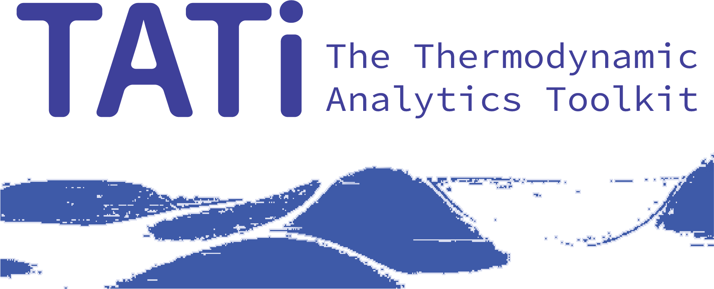

Thermodynamic Analytics Toolkit (TATi)
======================================
:Author:      Frederik Heber
:Email:       frederik.heber@gmail.com
:keywords:    neural networks, loss, loss manifold, sampling, exploration
:description: TATi is a software suite based on tensorflow that brings enhanced
              sampling methods based on Langevin Dynamics and Hamiltonian
              Dynamics to neural network training.
:Date:        {revdate}
:Revision:    TATi {revnumber}
:toc:
//:toc-placement: preamble
:doctype:     book
:imagesdir:   /home/heber/workspace_Python/ThermodynamicAnalyticsToolkit_asciidoc/doc/userguide

.{revdate} {version-label}: {revnumber}
***************************************
TATi is a software suite written in Python based on link:https://www.tensorflow.org/[tensorflow]'s
Python API. It brings advanced sampling methods (GLA1 and GLA2, BAOAB, HMC) to
_neural network training_. Its *tools* allow to assess the loss manifold's
topology that depends on the employed neural network and the dataset. Moreover,
its *simulations* module makes applying present sampling Python codes in the
context of neural networks easy and straight-forward.

TATi has received financial support from a seed funding grant and through a
Rutherford fellowship from the Alan Turing Institute in London (R-SIS-003,
R-RUT-001) and EPSRC grant no. EP/P006175/1 (Data Driven Coarse Graining using
Space-Time Diffusion Maps, B. Leimkuhler PI).

'Frederik Heber'
***************************************

include::introduction.adoc[]

include::quickstart.adoc[]

include::reference.adoc[]

include::tensorflow_flaws.adoc[]

Acknowledgements
----------------

Thanks to all users of the code!
